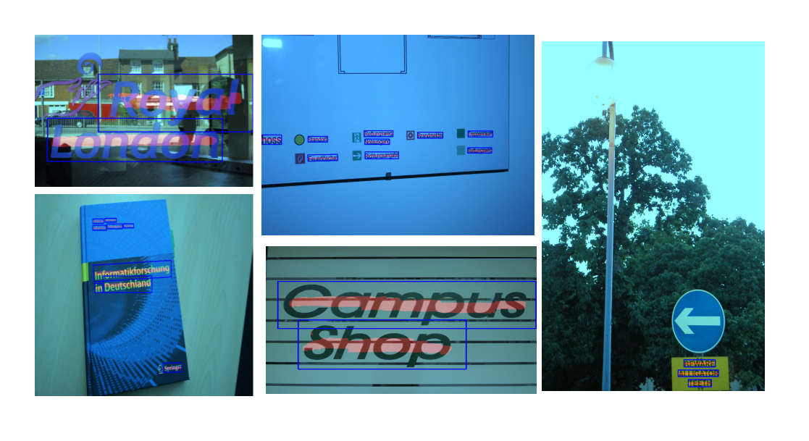

# STD: A Semantic-based Scene Text Detector

This repository is the official implementation of Semantic-based Scene Text Detector(STD for short), a new scene text detection method, inspired by the idea of [CSP](https://arxiv.org/abs/1904.02948), which is used on Pedestrian Detection. we evaluated STD on Icdar2013 dataset with a limited computing resources(only one GeForce GTX 1080), and achived 0.81 in F-measure with a single image scale.



## Introduction

STD is an efficient and fast method for scene text detection:

- no any further post-processings, like NMS.
- anchor-free.
- easy to generate training labels.
- only one step process to get final bounding boxes.

## Training

Download (gived below) SynthTextDetectionEnglish and Icdar13 dataset, training on SynthText about 5 epochs(up to you if you have more power and time), and finetune on icdar13 dataset.

Training image resize to 384x384 on SynthText, and finetune on Icdar13 with image size 384x384 for the first stage, then resize to larger size(e.g. 640) for the second stage, and decrease learning rate(e.g. 10x) synchronously until converges.

## Inference

Refer to [predict.py](./predict.py)

## Examples


## Dataset

SynthTextDetectionEnglish contains more than 300K images, download training image and annotations from [baiduyun, code:eq92](https://pan.baidu.com/s/1DT-vRyXtRXArc7Xj5XrYJA).

Icdar2013 dataset: training and testing images from [official site](https://rrc.cvc.uab.es/?ch=2&com=downloads) for Task 2.1 Text Localization. Download reconstructed annotations from [baiduyun, code:d9gb](https://pan.baidu.com/s/1deB5AoE3cqXoupr1FE51Ng).

## Limitations

STD only for vertical or horizontal text detection. and we are working on arbitrary direction text detection now, wouldn't be too long.

Any questions or suggestions,please drop a comment or contact me,email: gaolijun8080@163.com.

## License

This project is released under the [Apache 2.0 license](https://www.apache.org/licenses/LICENSE-2.0).

## Citation

If you use our codebase in your work, please cite this project.
a paper or technical report will be released soon.

And besides, you are welcomed to join us to maintain this project.

```
@misc{std2019,
  author =       {Gao Lijun},
  title =        {STD: A Semantic-based Scene Text Detector},
  howpublished = {\url{https://github.com/opconty/keras_std}},
  year =         {2019}
}
```
